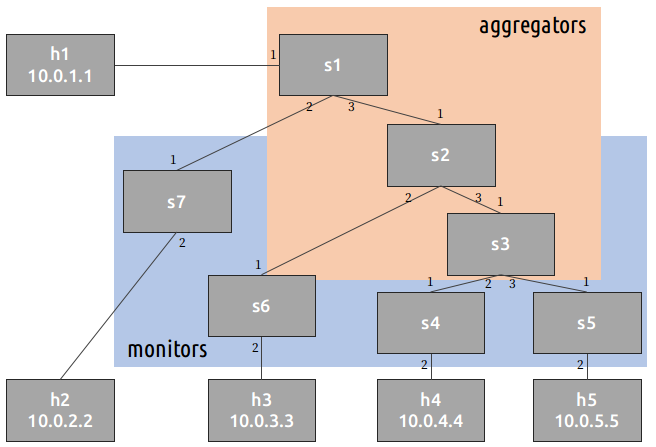

# Nested Aggregator

## Introduction

The objective of nested aggregator is to elimiated incast bandwidth
cost by picking multiple aggregators within the same query, while
forming a structured aggregation.

We adopt a tweak version of source routing, we configure our destination
with QID or Col, while both should be an integer ID (QID is variable > 0, while Col
is fixed -> 0)

Every switch (including non-monitor/aggregator) is configured a mapping
from QID/Col (as an destination) to nexthop port.

Furthermore, the monitor each have its own **attendence** bitmap showing
if it is arrived, while aggregator aggregates them by **AND**ing them, and
forward them once reach some fixed threshold.

## Information Plane

#### Control Plane

Responsible for
- Routing
- Aggregation bitmap prefix and forward threshold
